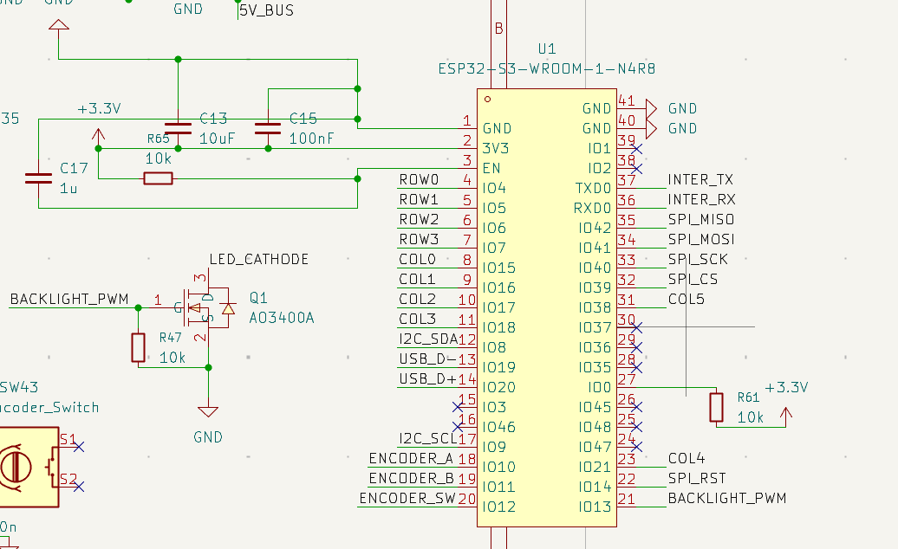
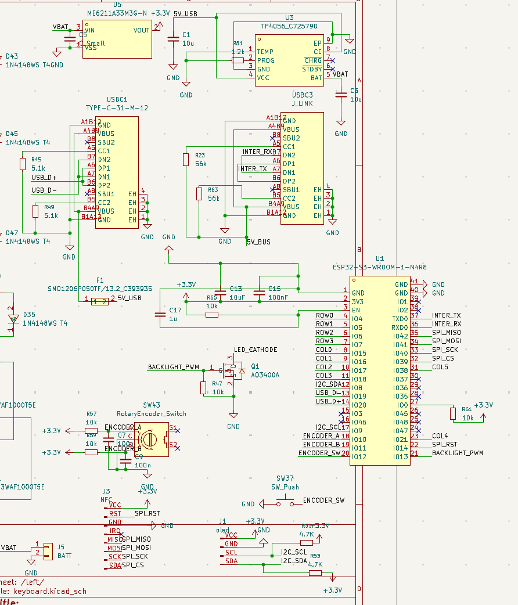
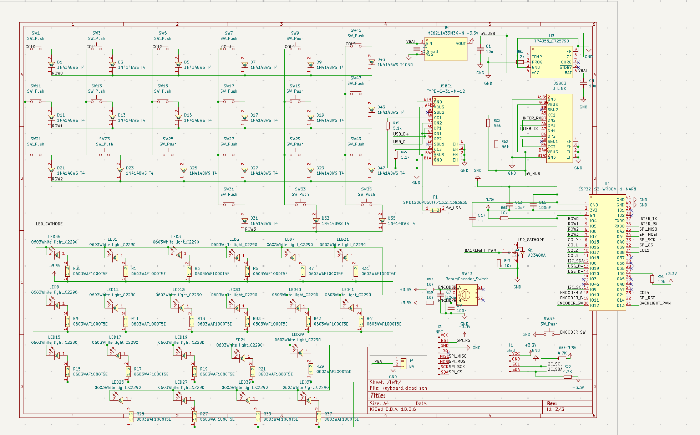

# October 1: Completing the Schematic

Today, I continued working on the split keyboard schematic in KiCad, focusing on completing the connections between the different components. After setting up the components and connecting the initial circuits over the previous sessions, I worked on bringing the entire schematic together.

## Finalizing the Connections

I completed the wiring for the key matrix, connecting the switches and diodes through the planned row-and-column arrangement. I also finalized the LED backlighting circuit, including the LEDs, their current-limiting resistors and the MOSFET used to control the backlight.

## Connecting the Main Electronics

I worked on the connections for the ESP32-S3-WROOM main controller, TP4056 battery charging circuit and ME6211 voltage regulator. I also finalized the connections around the USB Type-C connector and organized the power and signal connections between the different sections.

## Peripherals and Controls

I reviewed the peripheral connections, including the rotary encoder, its push switch, the NFC module connector and the battery connector. These components will support the keyboard's additional controls and planned features.

## Schematic Completed

With the different sections connected and organized using global labels, the initial schematic is now complete. It brings together the key matrix, LED backlighting, controller, power circuitry and peripheral connections in one design.

The next step is to check and correct the component footprints, review the schematic for electrical errors, and begin the PCB layout.

# Time spent this session: 2 hours 12 minutes
