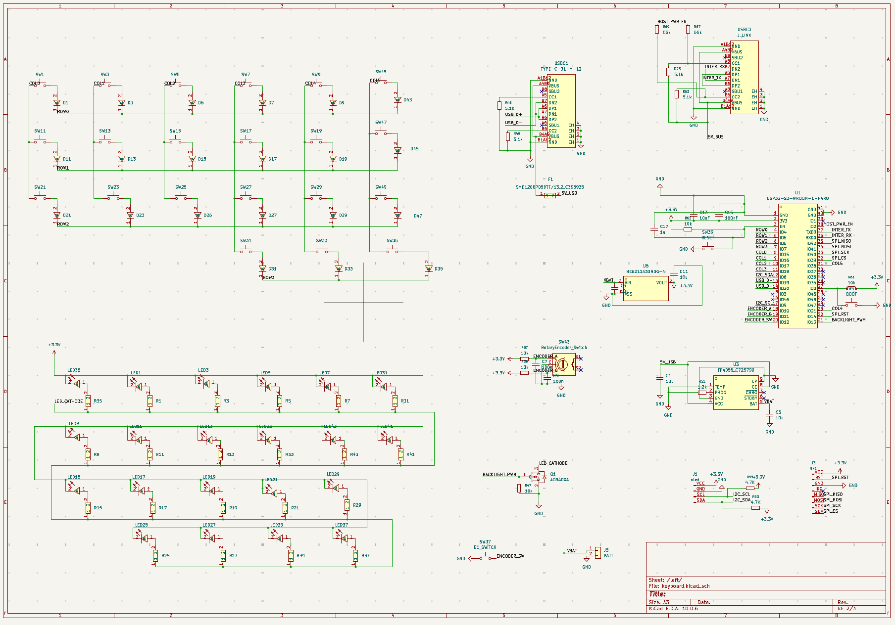
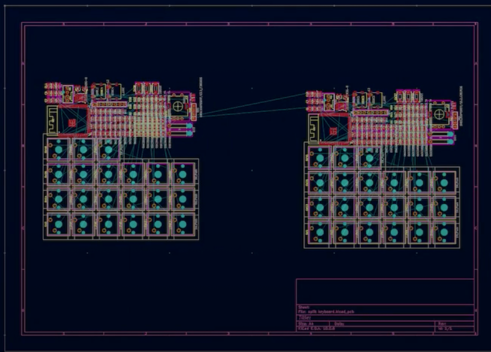
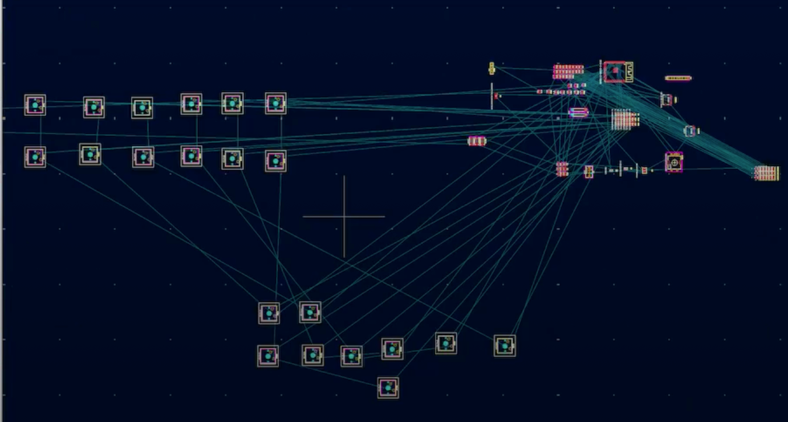

# October 2: Schematic Optimization & Starting the PCB

Today, I went back to the completed schematic and made the required corrections before moving on to the PCB stage. I also assigned the remaining footprints and started arranging the components in the PCB Editor.

## Updating and Optimizing the Schematic

Before starting the PCB, I reviewed the schematic again and made a few changes that were needed for the actual hardware implementation.

I corrected and added the required switch connections where they were needed, and cleaned up some of the existing connections. I also reorganized parts of the schematic to make the different sections easier to work with during PCB layout.

The USB and power section was refined as well. The USB connections, power-control lines and connections to the ESP32 were reorganized, while the charging and voltage-regulation sections were kept clearly separated. I also cleaned up the connections around the rotary encoder, NFC interface and battery connection.

Along with the schematic changes, I assigned and added the required footprints for the components so that they could be transferred correctly into the PCB Editor.

## Starting the PCB Layout

Once the schematic and footprints were ready, I opened the PCB Editor and transferred the components to the board. The key switch footprints were arranged according to the keyboard layout, while the remaining electronic components were brought into the board area.

## Initial Component Placement

I started arranging the components physically on the PCB instead of leaving everything clustered together. The key switches were used as the main reference for the layout, and the other components were positioned around them.

The ratsnest lines show the remaining electrical connections that still need to be routed. For now, the focus was on getting a sensible initial placement and understanding how everything would fit on the board.

## What's Next?

The next step is to refine the component placement, check the board dimensions and clearances, and start routing the PCB tracks. I will also make sure the placement works with the physical design and constraints of the split keyboard.

# Time spent this session: 2h 9mins
