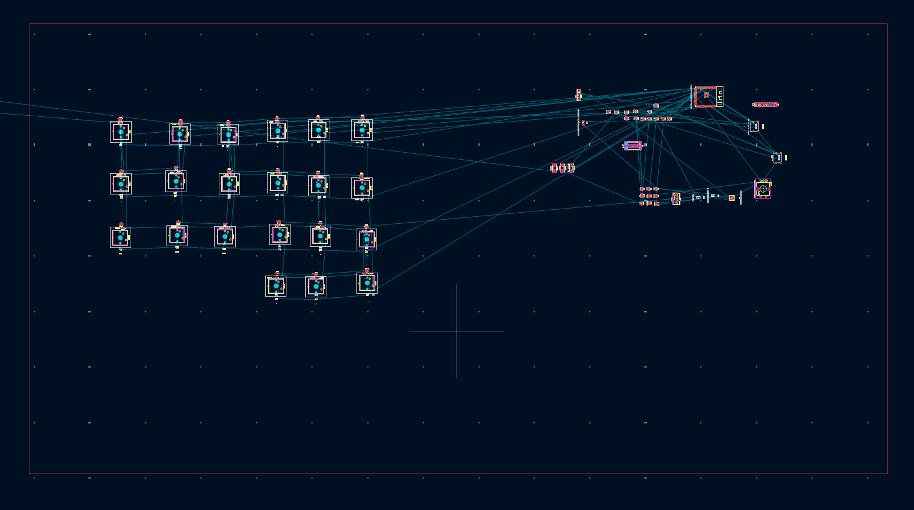
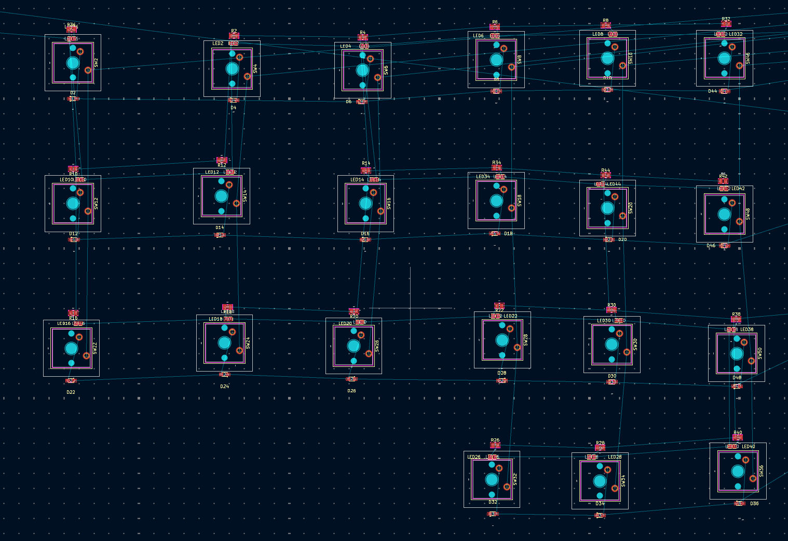
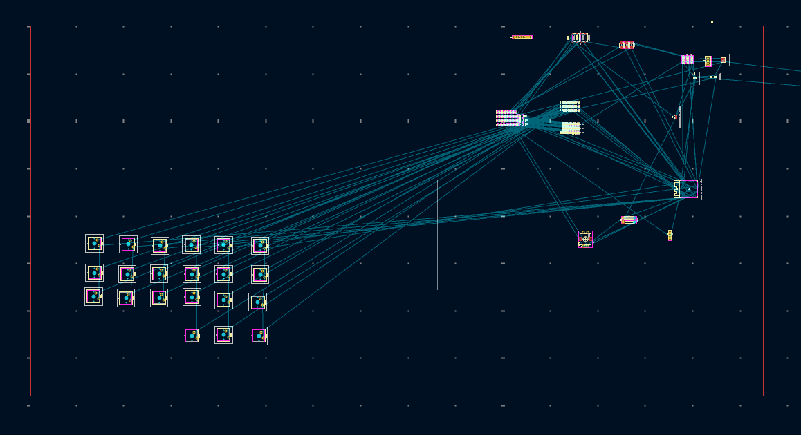

# October 4: PCB Component Placement

Today, I continued working on the PCB layout of the split keyboard, focusing on arranging the components around the individual keys.

## Arranging the Right Half

I focused mainly on the right half of the keyboard and started arranging the components into their intended positions. The key switches were placed according to the keyboard layout, and the supporting components were positioned around the corresponding switches.

For each key, I placed the LED, current-limiting resistor and diode close to the respective switch. This helped keep the components associated with each key together and made the layout more organized.

## Organizing the Components

I adjusted the spacing and positioning of the components around the switches instead of keeping them in the initial separated arrangement. The LEDs, resistors and diodes were positioned with the switch layout in mind, while keeping the electrical connections visible through the ratsnest lines.

## Starting the Left Half

After working on the right half, I also started arranging the left half of the keyboard. The basic switch layout has been placed, but the supporting components still need to be positioned and refined.

## What's Next?

The next step is to finish arranging the left half and refine the placement of the components on both sides. After the placement is finalized, I will work on the board outline, clearances and routing the PCB connections.

**Time spent this session:** 1h 34mins
