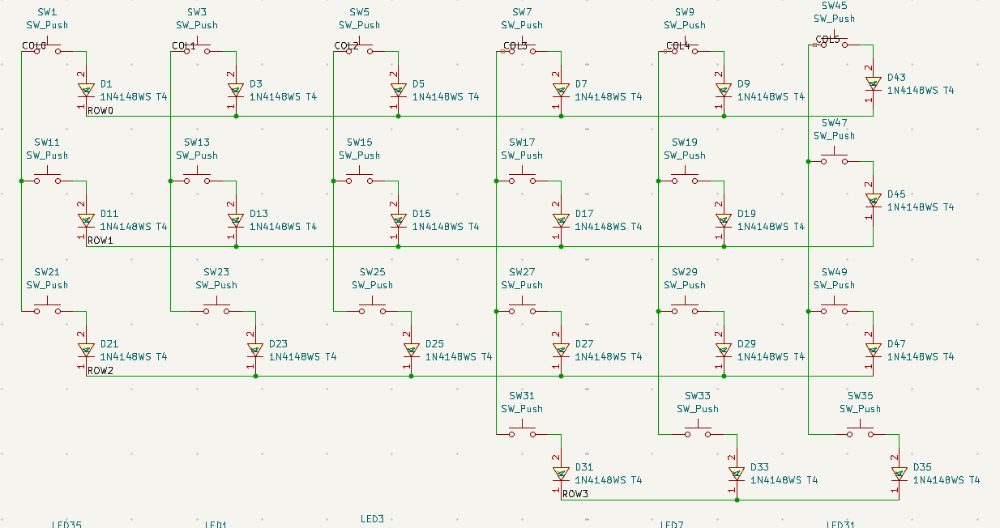
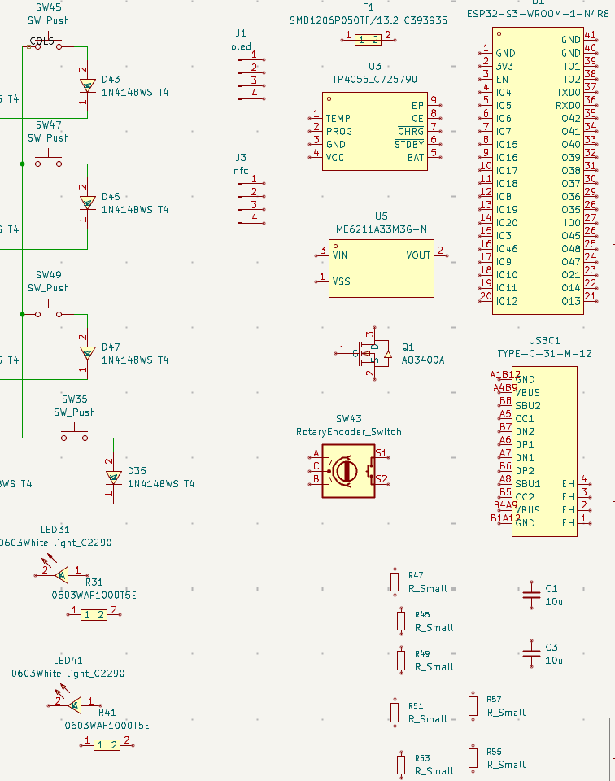
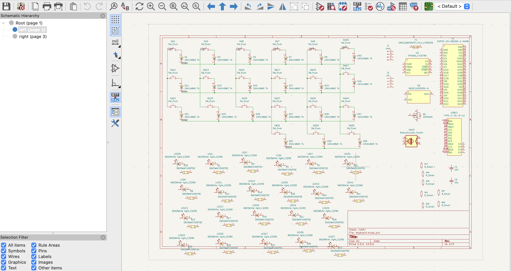

# September 29: Getting Started with the Schematic

Today, I started working on the schematic for my split mechanical keyboard. The first step was setting up the tools and gathering the components required for the design.

I set up KiCad for the schematic and EasyEDA to find the necessary component symbols and footprints. After downloading the required libraries, I started adding the components to the schematic.

# Setting up the key matrix

I added 21 keys, each with an individual diode, along with 21 LEDs and their corresponding resistors for the keyboard's backlighting.

The keys need to be arranged into rows and columns so that the controller can identify individual key presses. I started organizing these connections and added global labels to keep the schematic manageable as the design grows.

# Adding the main components

After setting up the keys, I added the other major components planned for the keyboard. These included the ESP32-E2 SMD as the main controller, a USB Type-C charging IC, a power MOSFET, a rotary encoder, an OLED display and an NFC reader.

I also added the supporting components: two capacitors, seven resistors and a fuse. The backlighting LEDs and their resistors were arranged separately from the key matrix.

# Putting the schematic together

With the main components in place, I continued organizing the different sections of the schematic and connecting related nets using global labels. This gave me an initial layout containing the key matrix, backlighting circuit and the other planned hardware.

The schematic is still a work in progress. The next step is to review the connections carefully and make sure the circuit is ready before moving on to PCB design.

I also attempted to record the session, but the KiCad workspace wasn't captured because I had selected the wrong screen. I've included screenshots here to document the work completed during the session.

## Time spent this session: 52 minutes
