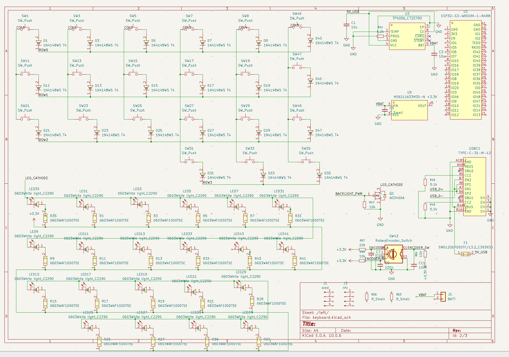
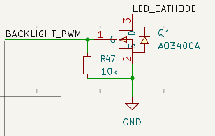
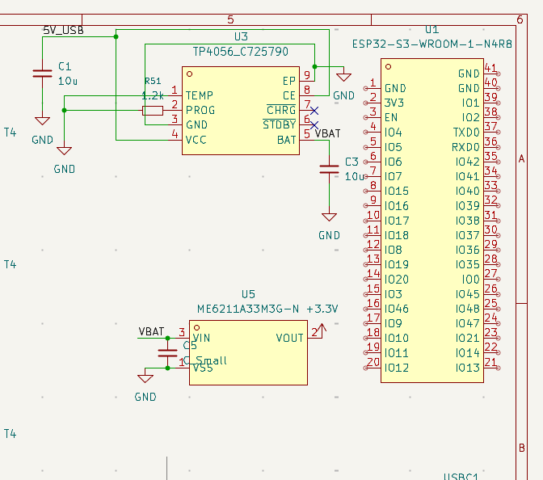
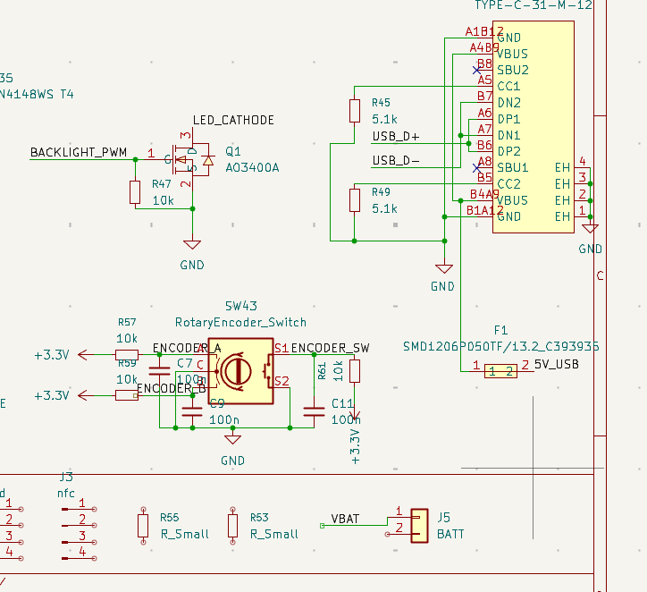

# September 30: Wiring Up the Schematic

Today, I continued working on the split keyboard schematic in KiCad. Yesterday was mostly about setting up the project and adding the required components. This time, I focused on connecting them and organizing the different parts of the circuit.

## Connecting the key matrix

I worked on the wiring for the key matrix, connecting the switches and their corresponding diodes in the planned row-and-column arrangement. I also continued organizing the connections so that the matrix could be interfaced with the main controller.

## Setting up the backlighting circuit

I worked on the wiring for the keyboard's backlighting LEDs and their resistors. The LEDs are arranged in multiple sections, with their connections organized around the 3.3V supply and a common control line. I also added the LED control circuitry, including the AO3400A MOSFET, for controlling the backlighting.

## Connecting the main electronics

I continued wiring the main electronic components, including the ESP32-S3-WROOM module, TP4056 charging IC and ME6211 voltage regulator. I worked on connecting the relevant power, ground and signal nets between these components.

I also added the supporting connections and capacitors around the charging and power regulation sections.

## USB-C and additional controls

I worked on the USB Type-C connector connections, including the USB data lines and the associated resistors. I also added the connections for the rotary encoder, along with its supporting components.

These sections will be important for the keyboard's charging, USB connectivity and physical controls.

## Bringing the schematic together

By the end of the session, I had made progress on the wiring across the key matrix, backlighting circuit, power section and peripheral connections. The schematic is now more developed than the initial component layout from the previous session.

The next step is to review the connections, check for missing or incorrect nets, and run the electrical rules checker (ERC) before moving on to PCB design.

## Time spent this session: 1hr 45 mins
